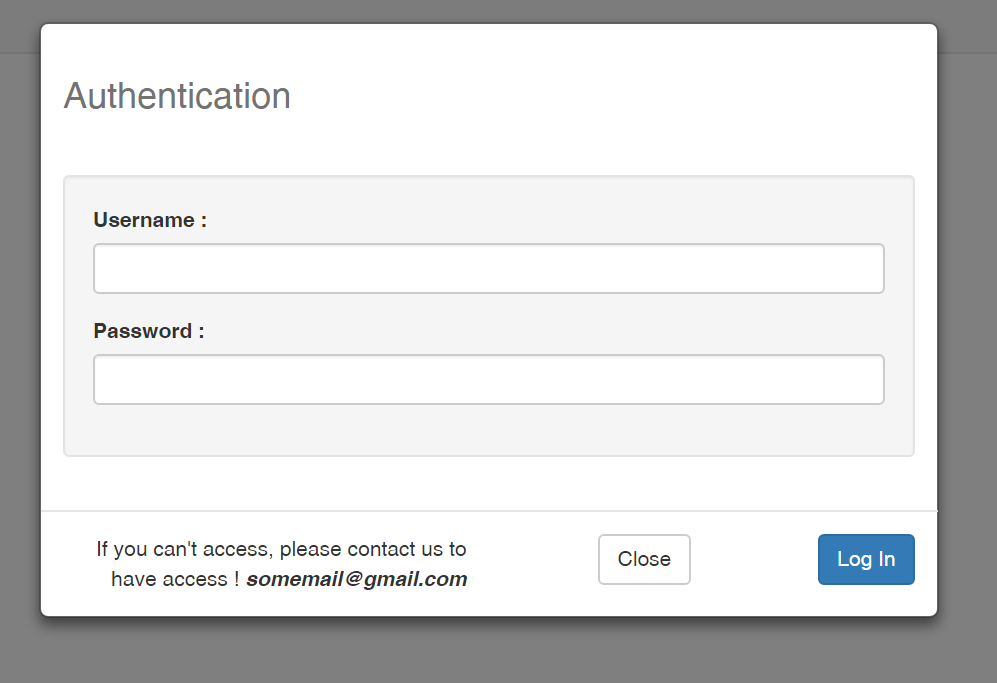
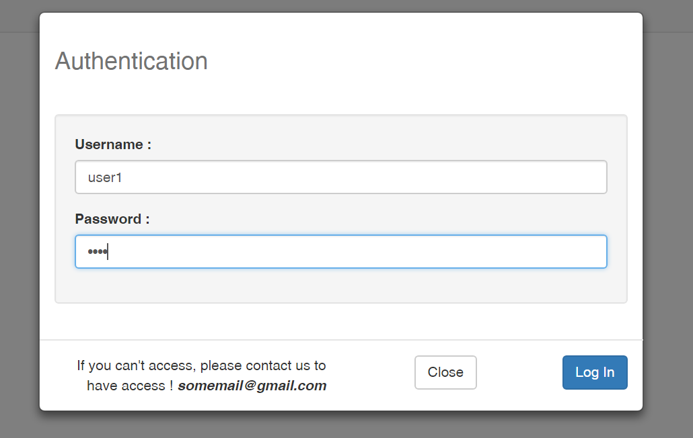
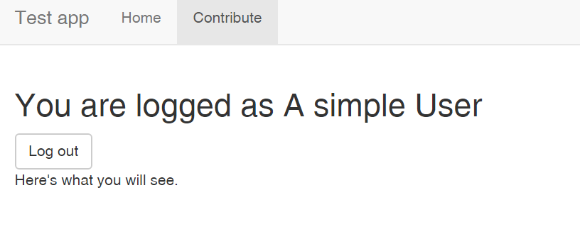
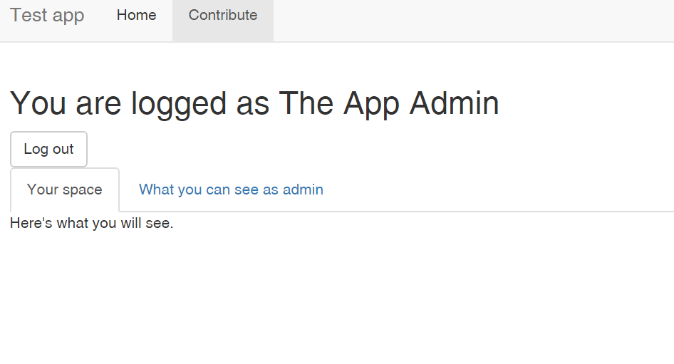

# A simple authentication mechanism

In this tutorial you'll learn how to implement a simple authentication mechanism for your Shiny App. 
The idea is simple, you have a public version of the app that everyone on the Internet can access but you also want to limit parts or all the app to a list of specified users you know beforehand. 

In this example the users are stored in an R data frame but you can apply the same principle to a database.

Here's an overview of what you'll get. 

## A log in page

## A page that shows for a simple user

## A page that shows for a the admin

